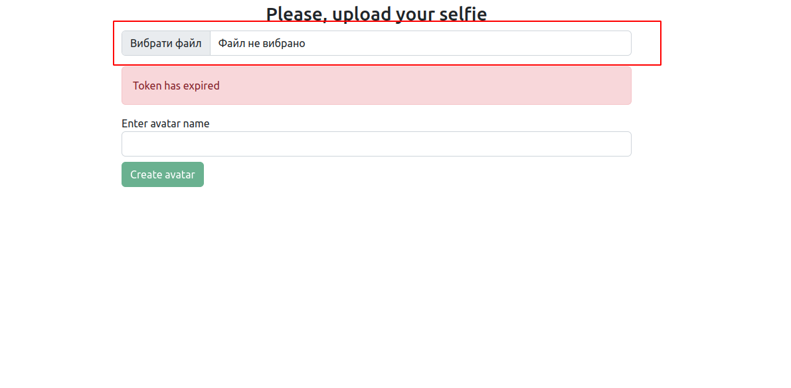

The project made as test task. It creates the avatar using a person's selfie.
The project requires:
NodeJS v18.9
npm v8.19.1

Deployment intructions:
### npm install
### npm run start

If you want to create production build, just run:
### npm run build

How to use:
1. Provide valid and non-expired token to src/Config.js file. Set it as access_token variable;
2. Provide your or your friend's selfie.

3. Then enter avatar name
4. Also you can use the body from the body bar. If you does not choose it, you will get only the 3D model of the face.
5. Press "Create avatar"